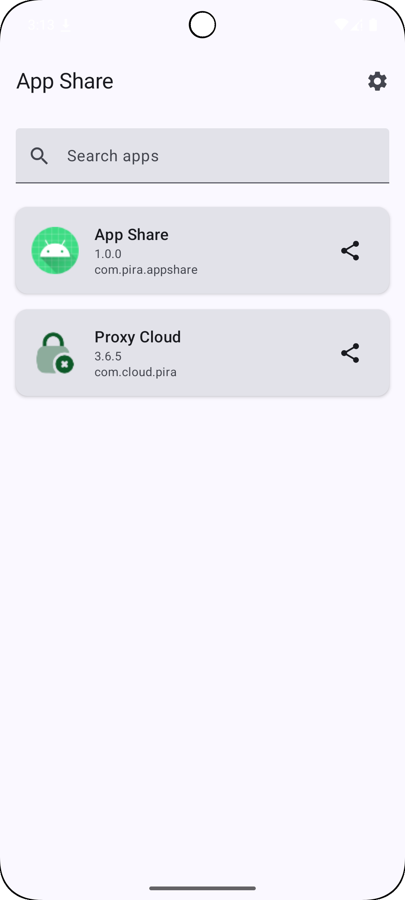
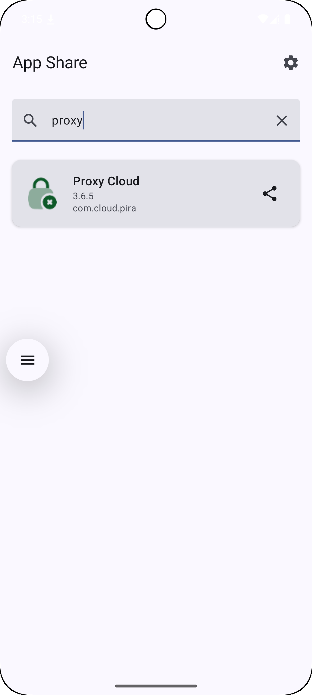
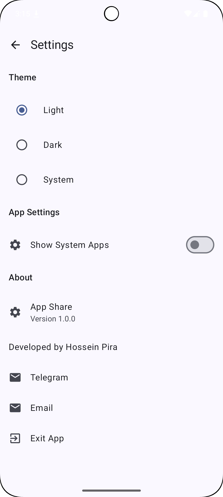
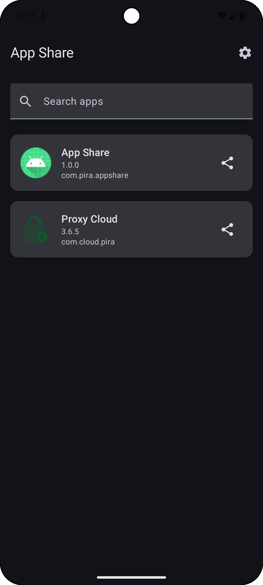

# AppShare

AppShare is an Android application that allows you to view installed applications on your device and share their APK files with others. Built with Jetpack Compose and Material Design 3, it provides a modern and intuitive user interface.

## Features

- 📱 View all installed applications on your device
- 🔍 Search functionality to quickly find apps
- 🌗 Dark/Light/System theme support with persistent settings
- 📤 Share APK files of installed applications
- ⚙️ Settings page with customization options
- 🛠 Show/hide system applications
- 📞 Developer contact information
- 📋 Display device ABI architecture information in settings
- 🖱 Improved UI with better icons for social links
- 🗑 Clear cache functionality to remove temporary APK files

## Screenshots

<div style="display:flex; flex-wrap:wrap; gap:10px;">
  
  
  
  
</div>

## Installation

### From GitHub Releases
1. Go to the [Releases](https://github.com/code3-dev/AppShare/releases) page
2. Download the latest APK file
3. Enable "Install from unknown sources" in your device settings
4. Open and install the APK

### Build from Source
1. Clone the repository:
   ```bash
   git clone https://github.com/code3-dev/AppShare.git
   ```
2. Open the project in Android Studio
3. Build the project:
   ```bash
   ./gradlew assembleRelease
   ```
4. Install the APK from `app/build/outputs/apk/release/`

## Requirements

- Android 7.0 (API level 24) or higher
- Minimum 50MB free storage space

## Permissions

- `QUERY_ALL_PACKAGES` - To list all installed applications
- `WRITE_EXTERNAL_STORAGE` - To share APK files (Android 10 and below)

## Development

This project is built with:
- Kotlin
- Jetpack Compose
- Material Design 3
- Accompanist Permissions

### Building

1. Clone the repository
2. Open in Android Studio
3. Sync Gradle dependencies
4. Build and run

### GitHub Actions

The project uses GitHub Actions for CI/CD:
- Automatically builds and releases APKs when a new tag is pushed
- Supports both debug and release builds

## Contributing

1. Fork the repository
2. Create a feature branch
3. Commit your changes
4. Push to the branch
5. Create a pull request

## Contact

- Telegram: [@h3dev](https://t.me/h3dev)
- Email: [h3dev.pira@mail.com](mailto:h3dev.pira@mail.com)

## Changelog

### v1.0.1
- Added device ABI architecture information display in settings about section
- Improved settings page scrolling functionality
- Enhanced Telegram icon in settings for better UX
- Fixed settings page layout to ensure all options are accessible
- Added clear cache functionality to remove temporary APK files

### v1.0.0
- Initial release
- App listing with search functionality
- APK sharing capability
- Theme selection (Light/Dark/System)
- Settings page with preferences
- Show/hide system apps option